# SSM 框架相关知识

> 官网：spring.io

spring 包括 spring 体系

```java
spring framework & springboot & spring data & spring cloud & spring security
```

spring framework 通常也被称为 spring 框架

```java
spring framework 是一个 IOC(DI) && AOP 框架
Spring 有很多优良特性
    非侵入式：基于Spring开发的应用中的对象可以不依赖于Spring的API
    依赖注入：DI（Dependency Injection）是反转控制（IOC）最经典的实现
    面向切面编程：Aspect Oriented Programming - AOP
    容器：Spring是一个容器，包含并管理应用对象的生命周期
    组件化：Spring通过将众多简单的组件配置组合成一个复杂应用。
    一站式：Spring提供了一系列框架，解决了应用开发中的众多问题

```

> IOC 容器的组件的存储使用哪种方式 ?（List，Map，Array）

```xml
<?xml version="1.0" encoding="UTF-8"?>
<beans xmlns="http://www.springframework.org/schema/beans"
       xmlns:xsi="http://www.w3.org/2001/XMLSchema-instance"
       xsi:schemaLocation="http://www.springframework.org/schema/beans http://www.springframework.org/schema/beans/spring-beans.xsd">
    <bean id="lisi" class="com.jiehfut.cssmdatasource.bean.Person">
        <property name="id" value="1"></property>
        <property name="name" value="李四"></property>
        <property name="age" value="#{10+2}"></property>
    </bean>
</beans>
```

```java
@SpringBootApplication
public class CSsmDatasourceApplication {
    public static void main(String[] args) {
        // 1.创建 ioc 容器
        ConfigurableApplicationContext ioc = SpringApplication.run(CSsmDatasourceApplication.class, args);
        // 2.获取注册的组件
        Person zhangsan = (Person) ioc.getBean("zhangsan");
        System.out.println("zhangsan = " + zhangsan);
    }
}
```

> AbstractApplicationContext 抽象类中一共有5中 getBean() 方法 = 这些抽象方法继承于 DefaultResourceLoader 类

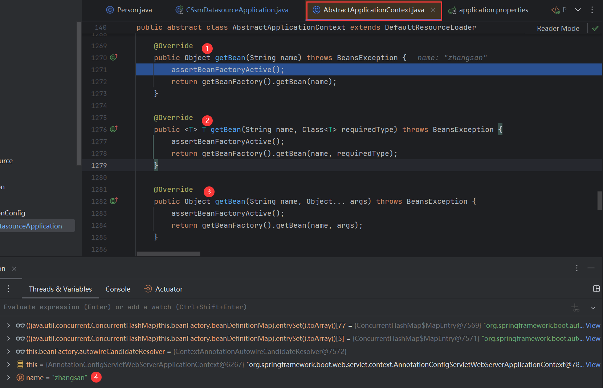

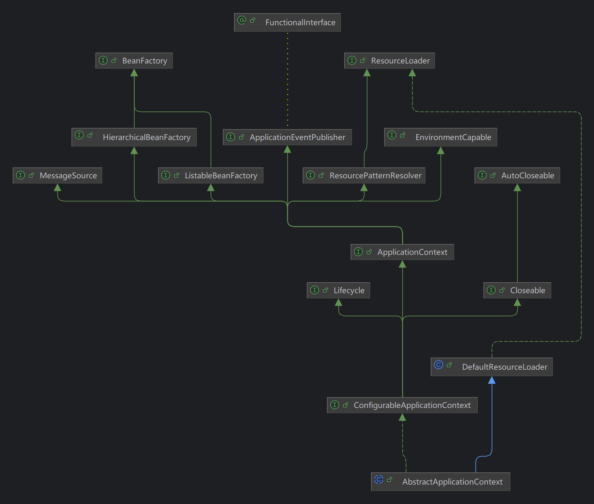


> getBeanFactory() 方法会获取一个 bean 工厂，响应给 getBean() 方法，getBean() 方法可以从工厂里面获取组件(对象)
>
> getBeanFactory() 方法为 GenericApplicationContext 方法继承 AbstractApplicationContext

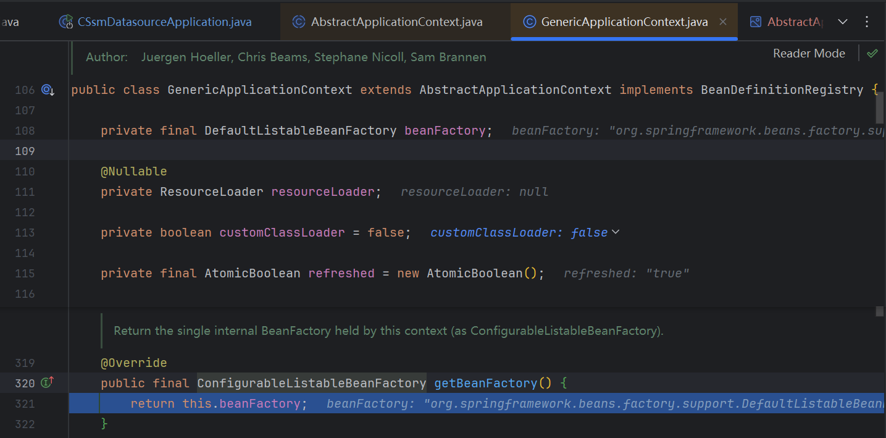

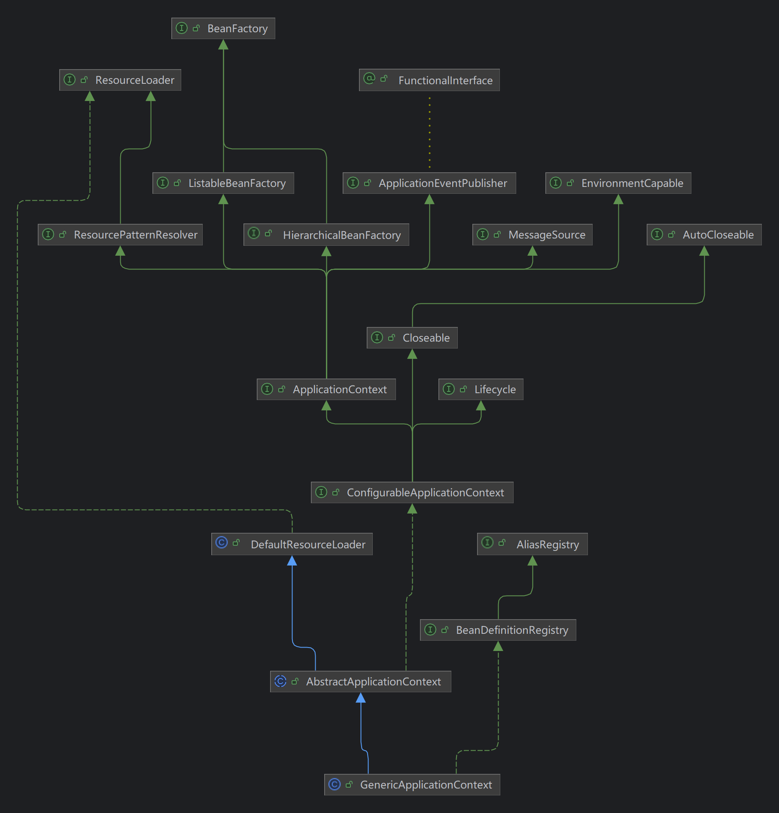


> 在 BeanFactory 工厂中包含很多东西（下面图片中为其中一部分）

```java
public interface BeanFactory {

	String FACTORY_BEAN_PREFIX = "&";

	Object getBean(String name) throws BeansException;

	<T> T getBean(String name, Class<T> requiredType) throws BeansException;
	
	<T> T getBean(Class<T> requiredType, Object... args) throws BeansException;

	<T> ObjectProvider<T> getBeanProvider(Class<T> requiredType);

	<T> ObjectProvider<T> getBeanProvider(ResolvableType requiredType);

	boolean containsBean(String name);

	boolean isSingleton(String name) throws NoSuchBeanDefinitionException;

	boolean isPrototype(String name) throws NoSuchBeanDefinitionException;

	boolean isTypeMatch(String name, ResolvableType typeToMatch) throws NoSuchBeanDefinitionException;

	boolean isTypeMatch(String name, Class<?> typeToMatch) throws NoSuchBeanDefinitionException;

	@Nullable
	Class<?> getType(String name) throws NoSuchBeanDefinitionException;

	@Nullable
	Class<?> getType(String name, boolean allowFactoryBeanInit) throws NoSuchBeanDefinitionException;

	String[] getAliases(String name);
}
```


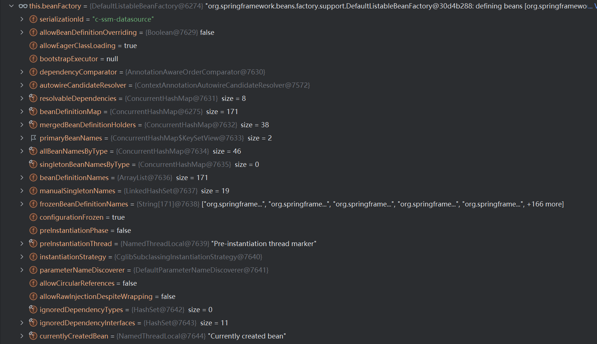

> 其中：registeredSingletons 是注册的单实例，原184个，加上自定义组件 zhangsan 185个，发现里面是所有组件的名称，Set 形式
>
> Set 形式可以快速判断，如重复

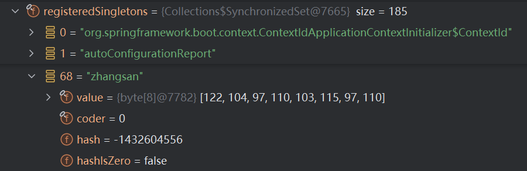

> 类似于 beanDefinitionNames 也是存储的组件的名称 170 + zhangsan = 171，以 List 形式保存

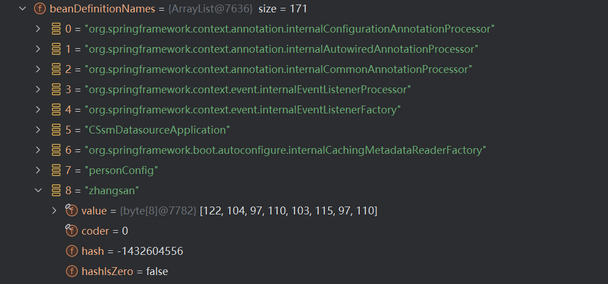

> 工厂里面的 beanDefinitionMap 里面存储的就是”图纸“，存储了各个组件的定义信息（不是具体的对象），以Map形式存储
>
> beanDefinitionMap 里面包括每一个组件的信息：是否单实例、是否为默认组件、绝对路径名、是否懒加载、构造器参数个数等...

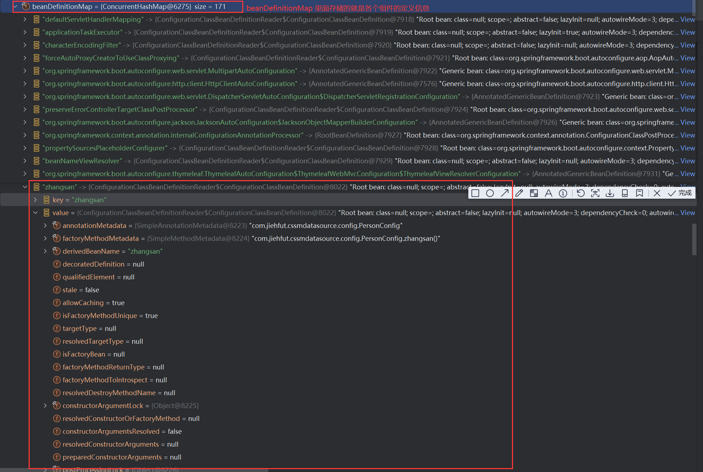

> spring 启动的时候会扫描（ComponentScan）每一个类，每一个注解，把扫描好的东西生产一堆”图纸“，BeanDefinition
>
> 放在一个 Map 集合中 BeanDefinitionMap
>
> 需要依赖注入的时候（单实例的组件启动的时候创建，懒加载和非单事例的注入的时候创建）
>
> 单例对象创建完成的对象（组件）放在 singletonObjects 中 - 原 184 个，加上 zhangsan 185 个，以 Map 形式存储

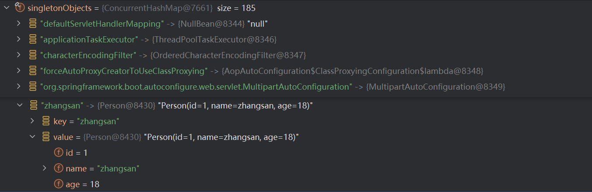


> getBean() 方法

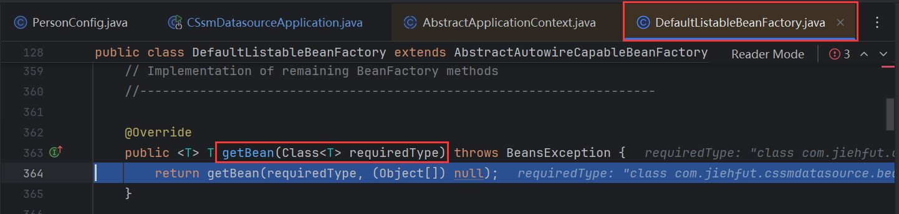

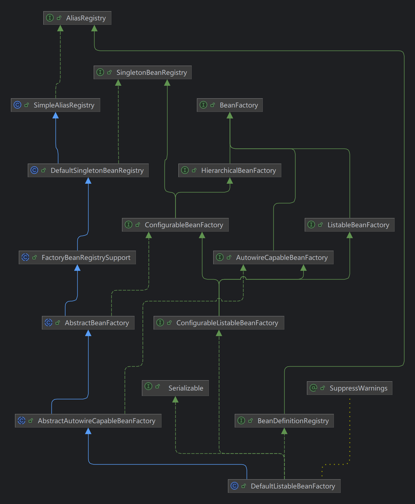

> getBean() 放行

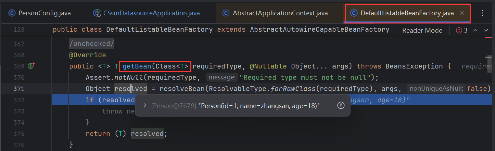

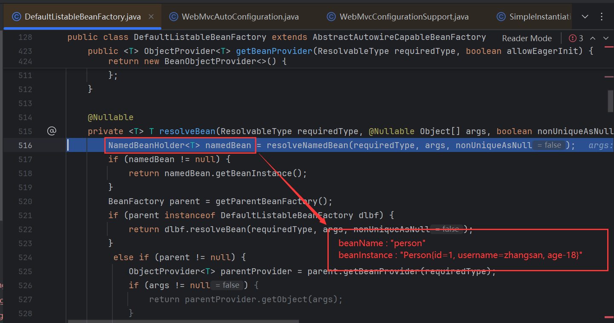

把 Bean 的名称和实例封装在一起(以 NamedBeanHolder 形式返回)

```java
public class NamedBeanHolder<T> implements NamedBean {
	private final String beanName;
	private final T beanInstance;
	public NamedBeanHolder(String beanName, T beanInstance) {
		Assert.notNull(beanName, "Bean name must not be null");
		this.beanName = beanName;
		this.beanInstance = beanInstance;
	}
	@Override
	public String getBeanName() {
		return this.beanName;
	}
	public T getBeanInstance() {
		return this.beanInstance;
	}
}
```

> 
>
> resolveNameBean() 方法中
>
> 1.按照类的类型找到所有 bean 的名字 => getSingleton(beanName) 再找到要对应的实例(单实例是在容器启动时就创建好的)

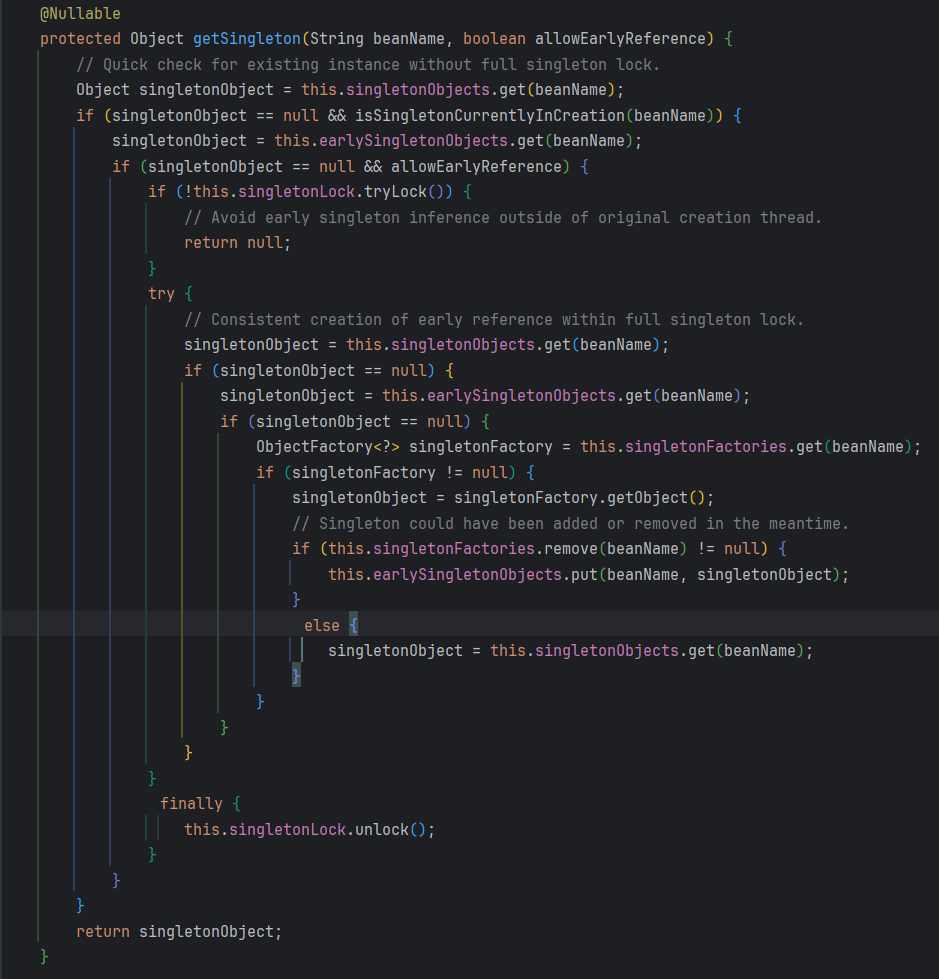

> 在寻找 bean 的过程就是在3个位置找（三级缓存）
>
> 三级缓存的存在是 spring 为了解决循环依赖的问题是（循环引用在 spring 中默认是关闭的，可以进行配置）
>
> 1、缓存单例对象 - 单例对象池
>
> ```java
> /** Cache of singleton objects: bean name to bean instance. */
> private final Map<String, Object> singletonObjects = new ConcurrentHashMap<>(256);
> 
> =======这个单例对象池存放的是成品区，是创建完成的组件=======
> ```
>
> 2、早期单例对象池
>
> ```java
> /** Cache of early singleton objects: bean name to bean instance. */
> private final Map<String, Object> earlySingletonObjects = new ConcurrentHashMap<>(16);
> 
> ========正在制造的组件（半成品）=======
> ```
>
> 3、上面两个找不到，加锁再找一边 - 然后去单例工厂找 getObject()，找到了放在 earlySingletonObjects 中
>
> ```java
> /** Creation-time registry of singleton factories: bean name to ObjectFactory. */
> private final Map<String, ObjectFactory<?>> singletonFactories = new ConcurrentHashMap<>(16);
> 
> =======如果不是简单制造的单实例，复杂的工厂制造 Bean 最晚制造，调用工厂的 getObject()=======
> ```

